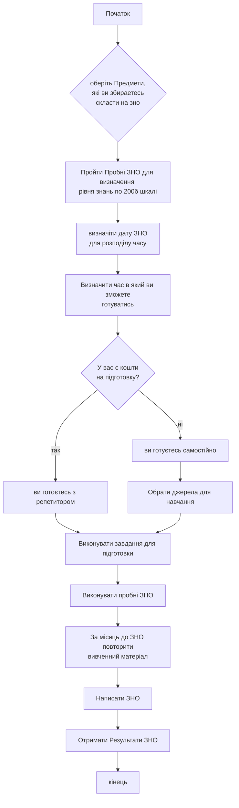

```Лабораторна Робота 6```:<br>
---
    1.Використання онлайн-сервісу DRAW.io для документації розроблених програм<br>
    2.Виконавець: Безпалый Артур Антонович
    3.Перевірила канд. екон. наук, доцент на кафедрі 601 Дем'яненко О. С.
---

